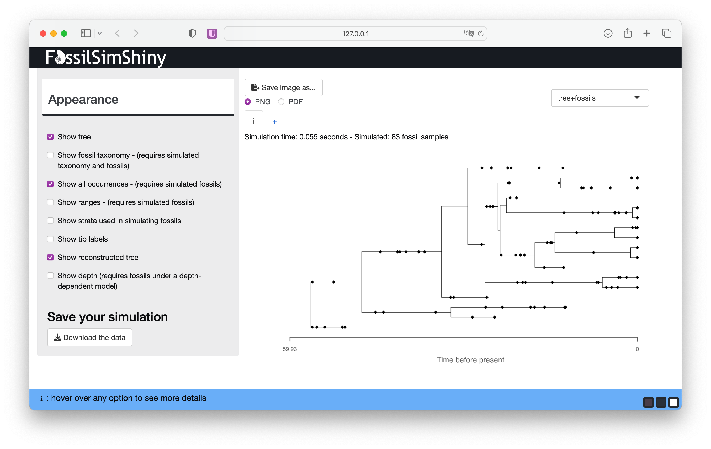
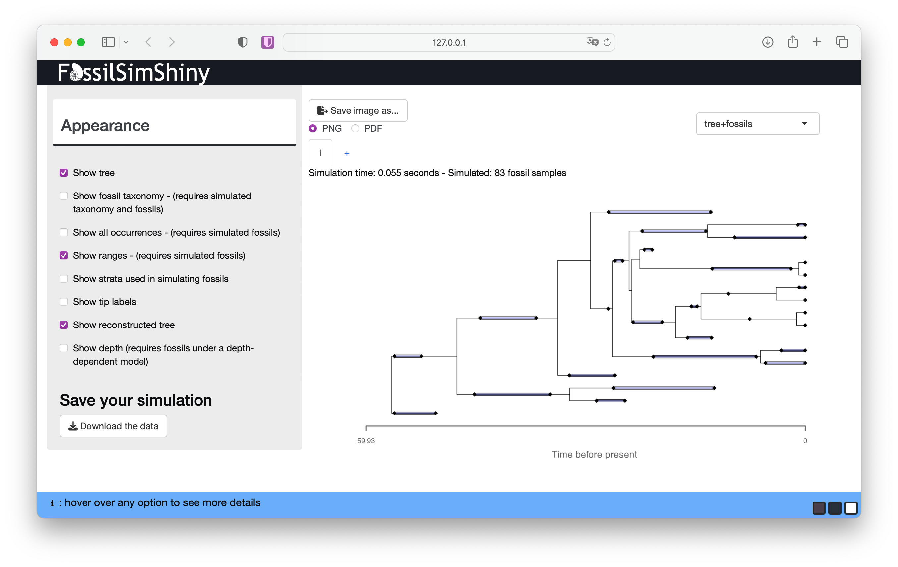
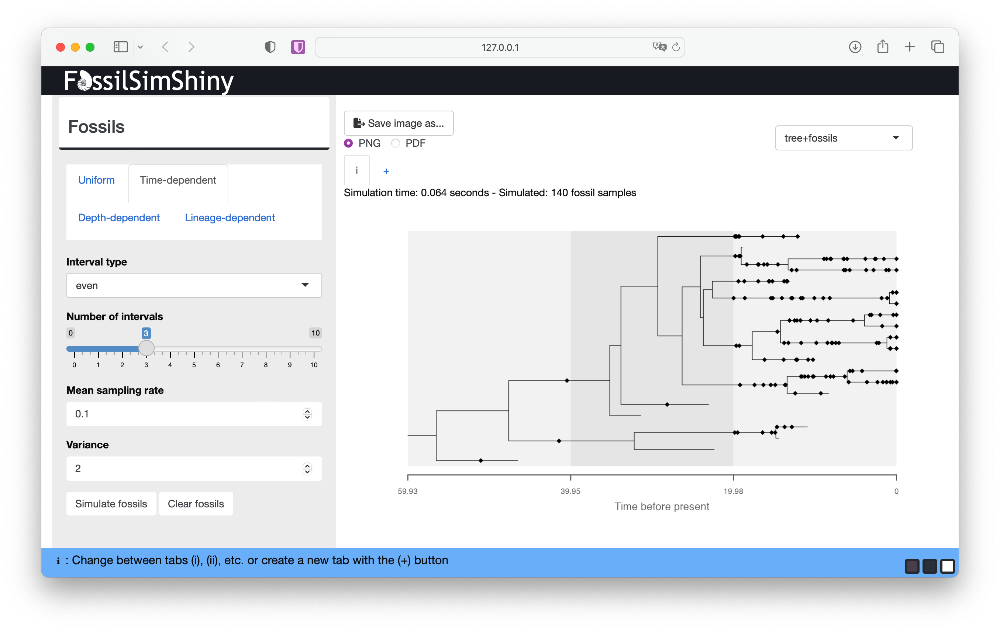
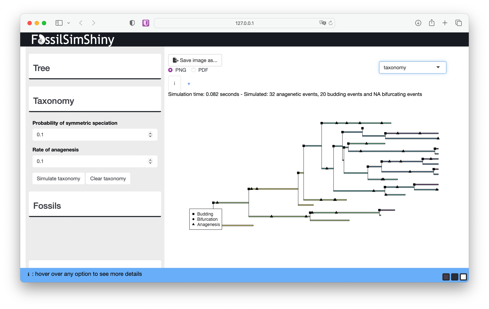
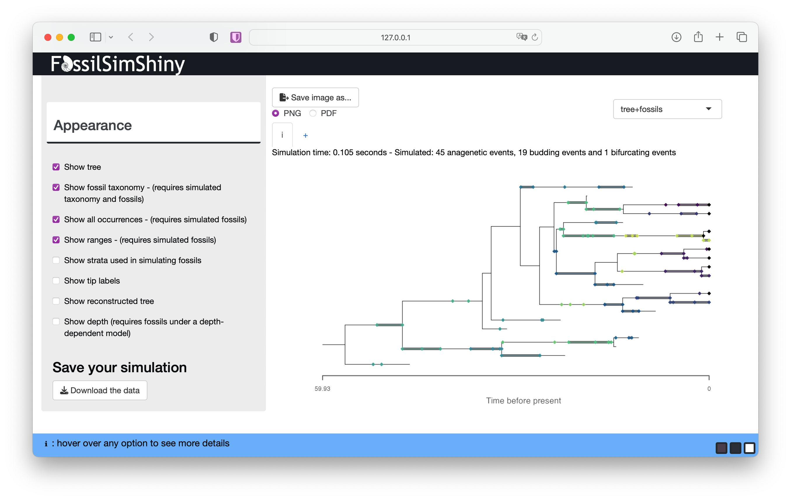

```{r setup, include=FALSE}
knitr::opts_chunk$set(echo = TRUE)
```

\

# Exploring model assumptions using the FossilSimShiny app

This exercise will walk you through key assumptions of the fossilized birth-death (FBD) process (and related models) using the FossilSimShiny app, which uses the R packages TreeSim and FossilSim for simulation.

The FBD process is a joint model of diversification and sampling, first described in Stadler (2010). It can be used to calculate the probability of observing a reconstructed phylogeny with fossils as extinct leaves or sampled ancestors. The model is statistically coherent for the analysis of phylogenetic and fossil data because it incorporates explicit assumptions about the underlying data generating processes. This means we can forward simulate, as well as perform inference, under the model, which is a major advantage for understanding the model properties and assumptions. We can also use the app to explore other models of fossil sampling, as well as models of taxonomy and speciation.

Install the necessary R packages.

```{r packages, eval=FALSE}
install.packages("TreeSim")
install.packages("FossilSim")
install.packages("FossilSimShiny")
```

To launch the FossilSimShiny app on your computer simply run the following in R.

```{r, eval=FALSE}
FossilSimShiny::launchFossilSimShiny()
```

This should open the app in your default browser and look like the image below.

```{r, echo=FALSE, out.width="100%"}
knitr::include_graphics("shiny_01.png") #out.extra='style="float:right;padding:30px'
```

On the upper left there are three menus used for different aspects of the simulation: **Tree**, **Taxonomy** and **Fossils**. On the lower left is the **Appearance** menu where you can change how the simulated data is displayed. On the upper right you can also use the drop down menu to toggle between display options.

## The diversification process

First we'll simulate trees, and explore the role of the birth and death parameters. Navigate to the **Tree** menu. 

We'll simulate birth-death trees conditioned on the number of tips $n$ (**Tip number**). The underlying function simulates birth and death events forward in time until there are $n$ co-existing lineages. 

Let's give it a go. 

```{r, echo=FALSE, out.width="100%"}
knitr::include_graphics("shiny_02.png") 
```

The function simulates the *complete tree*, that is, the tree containing all lineages that were ever part of the tree. This includes all extinct lineages and the $n$ extant samples at the end of the process ($t = 0$). The black diamonds indicated the extant samples here. 
Learn more about the complete and reconstructed trees [below](FossilSimShiny.html#reconstructed).

Run the function a few more times without changing any of the parameters. You should notice that each tree looks quite different. This reflects the stochasticity inherent in the birth-death process $-$ the same combination of speciation and extinction parameters will result a wide range of possible outcomes. These rate parameters are often referred to as the birth ($\lambda$) and death ($\mu$) rates.

> Next, increase the **Speciation rate** to something like 0.3, and simulate some new trees. Do you notice any general differences? Next, increase the **Extinction rate** to something like 0.25 and do the same. What do you notice this time?

Before we move on, see if you can built up some intuition for the interaction between the speciation and extinction rates.

*To simulate trees using the same approach in R you can use the* `TreeSim` *package function* `sim.taxa.bd`.

## The fossil sampling process

Next we'll simulate fossils. Navigate to the **Fossils** menu. 

### Uniform sampling

We'll start with constant fossil sampling. This is the assumption made by the original FBD model described by Stadler (2010).

Start with the default parameters and select **Simulate fossils**.

```{r, echo=FALSE, out.width="100%"}
knitr::include_graphics("shiny_03.png") 
```

Each diamond plotted along the tree branches represents a fossil occurrence.
Here, an "occurrence" represents a singular observation of a lineage at a single point in time. 
In reality, a lineage can be sampled multiple times at a given time (e.g., if multiple specimens are sampled at the same locality, sometimes known as abundance data) but the FBD model can't currently account for this type of information.
This reflects the fact that the model assumes a [Poisson sampling process](https://en.wikipedia.org/wiki/Poisson_distribution).

At the top of the screen you can see details about your simulation, including the number of simulated fossil samples.
You should notice that if you simulate fossils using the same sampling rate, each simulation will generate a different number of samples.
The sampling parameter ($\psi$) is the rate at which fossils are sampled along branches in the phylogeny, and encompasses all processes that lead to fossilisation and sampling. 

> What happens if you decrease or increase the **Sampling rate**?

Before we move on, toggle between the **Tree** and **Fossils** menus to see if you can built up some intuition for the interaction between the speciation, extinction *and* sampling rates.

The app has a lot of options for changing the output that is displayed. Scroll down to the **Appearance** menu to view the options. 

> Deselect **Show tree**. What do you notice about the distribution of fossils through time when you change the speciation, extinction and sampling rates?

Through this approach you should begin to get a sense of the interaction between the speciation, extinction, sampling rates and the distribution of fossils. This interaction is why the distribution of fossil sampling times is informative about the model parameters. 

*To simulate fossils using the same approach in R you can use the* `FossilSim` *package function* `sim.fossils.poisson`.

### The complete vs reconstructed tree {#reconstructed}

Stay in the **Appearance menu** for now and select **Show reconstructed tree**. 
This will show you the contrast between the complete and reconstructed trees.

```{r, echo=FALSE, out.width="100%"}
 
```

After adding fossil sampling, the complete tree will be the outcome of the diversification and sampling processes and will include all observed and unobserved lineages, plus all fossil and extant samples. 
In contrast, the reconstructed tree is the one we can estimate from our observed samples and is the tree object that we use to calculate the probability under the FBD model during inference.

> What differences do you notice between your complete and reconstructed trees?

### Stratigraphic ranges

In the appearance menu you can also choose to display stratigraphic ranges. 
If you select **Show ranges** and deselect **Show all occurrences** this will show the complete or reconstructed tree with stratigraphic ranges - that is, the interval between the first and last appearance of a lineage in the fossil record.

```{r, echo=FALSE, out.width="100%"}
 
```

The purple lines between the first and last appearance represent the stratigraphic ranges. 
The first and last appearances are represented by the black diamonds as before. 
If a lineage is sampled only once (i.e., the first and last appearance are the same), the lineage is represented by a single occurrence.

> What do you notice about the range durations if you change the speciation, extinction or rate parameters?

The FBD range model, which can be used to calculate the probability of a tree with ranges, was described in Stadler et al. (2018). 

Note that by default the simulation functions assume each branch represents a unique taxon, which is equivalent to assuming all speciation is fully symmetric or bifurcating. 
See section [Taxonomy](FossilSimShiny.html#taxonomy) to learn more about this.

### Time-dependent sampling

Return to the **Fossils** menu and select the **Time-dependent** option.

Next we'll simulate fossils with rate variation through time. Using this option, discrete intervals are assigned a separate rate.
This is equivalent to the assumptions made by the FBD skyline model (Gavryushkina, 2014).

Go to the **Interval type** drop down menu and select **even**.
Use the **Number of intervals** slider to select the number of intervals you'd like. Rates are simulated from a lognormal distribution with user specified parameters **Mean sampling** rate and **Variance**.

Scroll down to the **Appearance** menu and select **Show strata used in simulating fossils**

```{r, echo=FALSE, out.width="100%"}
 
```

You should be able to see variation in the density of fossils through time, although this will depend on the magnitude of the difference in rates between intervals, as well as the total number of lineages that occur in each interval. 

> Experiment with the other settings associated with time-dependent sampling and deselect **Show tree** again from the **Appearance menu**. What do you notice about the distribution of fossils through time with different rates of specation, extinction or variation in sampling?

*To simulate fossils using the same approach in R you can use the* `FossilSim` *package function* `sim.fossils.intervals`.

## Taxonomy {#taxonomy}

Navigate to the **Taxonomy** menu. Here we can incorporate explicit assumptions about taxonomy or  speciation mode.
There are three main modes of speciation that can be considered in the context of birth-death process models:
* asymmetric or budding speciation, where a lineage splitting event gives rise to a single new species
* symmetric or bifurcating specation, where a a lineage splitting event gives rise to two new species and results in the extinction of the ancestral species
* anagenesis, where speciation occurs along internal branches and there are no associated lineage splitting events

The assumptions made by birth-death processes about speciation mode are not immediately obvious. 
In standard birth-death models, mathematically we assume that speciation events are asymmetric, since lineage splitting events give rise to a single new lineage.
This isn't always clear, since in phylogenetics we tend to plot trees as full bifurcating, as if each lineage splitting events gives rise to two new lineages. 
Meanwhile, in paleontology taxa defined on the basis of morphology, and may be the result of symmetric, asymmetric or anagenetic speciation.
For more about the implications of this see Silvestro et al. (2014).

Under the original FBD model we don't make any assumptions about how fossil samples are linked to species or taxa through time, but it becomes important to consider when we want to infer trees using stratigraphic ranges. Stadler et al. (2018) introduced the possibility that speciation could via any of the above three modes.

By default the FossilSimShiny app assumes that all speciation events are symmetric. Thus, when we plot the ranges, each range is associated with a single branch in a bifurcating tree.

If you navigate to the **Taxonomy menu** we can introduce alternative speciation modes. 
The **Probability of symmetric speciation** is the probability that a given lineage splitting event will be symmetric or bifurcating ($\beta$) (otherwise it is asymmetric or budding with probability $\beta-1$).
The **Rate of anagenesis** is simply the rate of anagensis along branches ($\lambda_a$).
Simulate taxonomy starting with the default values.

```{r, echo=FALSE, out.width="100%"}
 
```

The **taxonomy** plot shows how speciation events are distributed across the tree. You can use the legend to identify the symbol associated with each speciation mode. 

> Experiment with the **Probability of symmetric speciation** and **Rate of anagenesis** parameters. Do the numbers of each speciation make sense based on the input parameters you use?

If you select **tree+fossils** from the top right, you can also see the fossils coloured according to their taxonomy.

```{r, echo=FALSE, out.width="100%"}
 
```

> What challenges do you percieve working with range data and conventional phylogenetic approaches that do not take speciation mode into account? Or when comparing parameter estimates based on fossils vs. phylogenies?

> If you have time you can return and experiment with the **Depth-dependent** and **Lineage-dependent** sampling.

