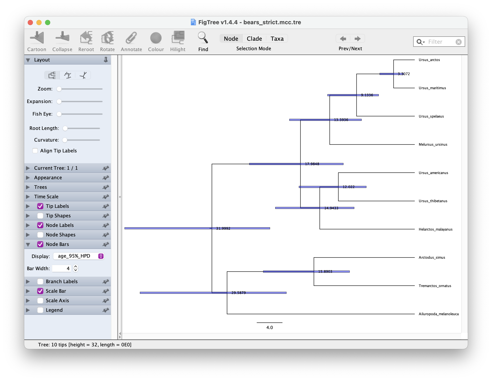

```{r setup, include=FALSE}
knitr::opts_chunk$set(echo = TRUE)
```

\

```{r hidden_notes, eval=FALSE, echo=TRUE}
# **Notes**
# Hopefully the app will be up and running on our server. Status: have made enquires.
# I was wondering if should change Speciation and Extinction to birth and death rate, since as you point out, these parameters are not strictly equivalent.

#TODO: any mention of the Poisson process?
#TODO: any discussion of birth, death and expected root age.
#TODO: how does taxonomy fit into this? these don't currently interact

# **To dos**
#TODO: assign a max tip number, to reduce pressure on the server - 100?**
#TODO: impose any limits on the user specific tree?
#TODO: the default psi value is too high, relative to the default birth and death rates**
#TODO: make the branches thicker**
#TODO: option to add seed number? so you can reproduce the fig?
#TODO: what about extant species sample

```

# Exploring model assumptions and the fossilized birth-death process

This exercise will walk through key assumptions of the fossilized birth-death (FBD) process using the FossilSim shiny app.

The FBD process is a joint model of diversification and sampling, first described in Stadler (2010). It can be used to calculate the probability of observing a phylogeny with fossils, extinct leaves or sampled ancestors. 

The model is statistically coherent for the analysis of phylogenetic and fossil data because features explicit assumptions about the underlying data generating processes. This means we can forward simulate under the model, which is a major advantage for understanding the model properties and assumptions. - switch the logic here? 

## Model parameters

The model has four parameters:
 * lineage birth rate ($\lambda$)
 * lineage death rate ($\mu$)
 * fossil recovery rate ($\psi$)
 * probability of extant species sampling ($\rho$)
 
The birth and death rate parameters are part of the diversification component of the model and describe how the tree grows over time, while the fossil recovery and extant species sampling parameters describe how the tree is *incompletely* sampled over time. 

The diversification and sampling processes can be considered separately, which is convenient for both  simulation and understanding different the two components (diversification and sampling) of the model. 
## The diversification process

First we'll simulate trees, and explore the role of the birth and death parameters.

The app is set up to simulate birth-death trees conditioned on the number of tips $n$. The function simulates birth and death events forward in time until there are $n$ co-existing lineages. 

Let's give it a go. 

Select the **Tree** tab, leave the parameters as they are for now and click **Simulate tree**. 

This will generate a tree that should look something like this.

```{r, echo=FALSE, eval=FALSE, out.width="85%",  out.extra='style="padding:10px"'}
#TODO
#
```

Note the function simulates the *complete tree*, that is, the tree containing all lineages that were ever part of the tree (observed and unobserved).

Click **Simulate tree** a few more times without changing any of the parameters. You should notice that each tree looks quite different. This reflects the stochasticity inherent in the birth-death process - the same combination of birth and death parameter will result a wide range of possible outcomes.

Next, increase the birth rate to something like 0.3, and simulate some new trees. Do you notice any general differences about the trees? Next, increase the death rate to something like 0.25 and do the same. What do you notice this time?

Let's move on the next step.

## The fossil sampling process

Next 

## Other things you can do

You can also provide a user starting tree, if you wanted to look at the impact of different fossil sampling scenarios for a group you're working on.


## Running the code in R

The app uses the package TreeSim and FossilSim. 

```{r packages, eval=FALSE}
install.packages("TreeSim")
install.packages("FossilSim")
```

The TreeSim function `sim.taxa.bd` is used to simulate the complete tree.

```{r paras, eval=FALSE}

tips <- 10
birth <- 0.1
death <- 0.05

tree <- TreeSim::sim.bd.taxa(tips, 1, birth, death)[[1]]
```

The TreeSim function `sim.taxa.bd` is used to simulate trees.

```{r sampl, eval=FALSE}

```