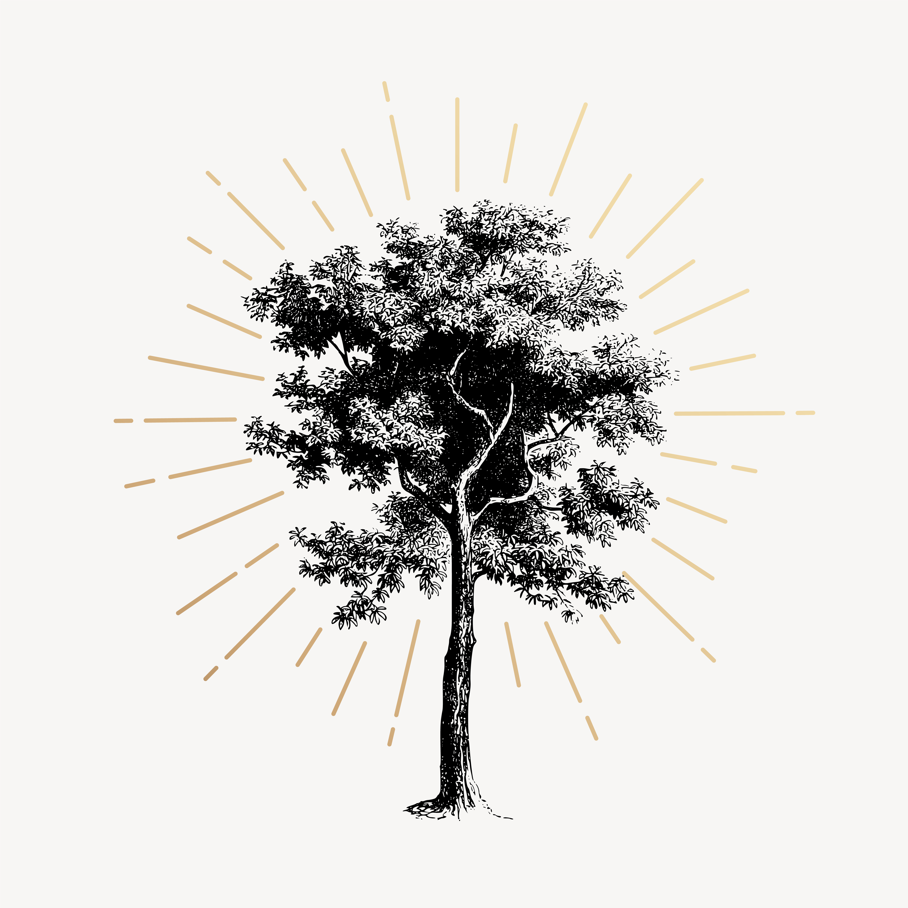

```{r, echo=FALSE, out.width="50%",  out.extra='style="float:right; padding:30px"'}

```

\

# Course description

This hands on course focuses on the use of **Bayesian phylogenetics** in paleobiology. 
You will learn about approaches used to infer trees, divergence times and evolutionary rates. 

The course will take place in the summer semester (mostly) **Thursdays 16:00-18:00 CET** both in person at Henke Str. and online [via Zoom](https://fau.zoom.us/j/67756970533). We should finish before 18:00 most weeks.

The first half of the semester will feature a mix of lectures and tutorial material.
Aside from week one, the course will focus on getting to grips with the software [RevBayes](https://revbayes.github.io). By the end of the course students should understand the principles of Bayesian phylogenetic inference and be able to apply this knowledge to a research question of their choosing.
During the second half of the semester each participant will work on their own project on a topic of their choice. 
You will also have the opportunity to present your research and any challenges to our guest lectures. 

Course organizers: **Rachel Warnock** and **Laura Mulvey**.

Celebrity guests: **Joëlle Barido-Sottani** (June 16) & **Sebastian Hoehna** (July 7).

There are no tasks to complete before the course begins!

\

# Course evaluation

At the end of the course you should produce a short report based on your research findings. 
We will shortly provide you with a template and guidelines. 
The deadline for the report is **Friday 29th of July**.

Note: the full title of this course is "Models in paleobiology and phylogenetics (RL-V3 MPP)”.

\

# Any questions?

Email rachel.warnock@fau.de

\
\

Images: rawpixel.com

